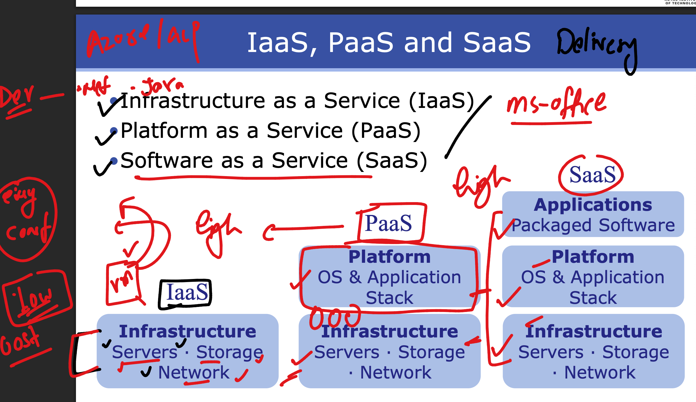
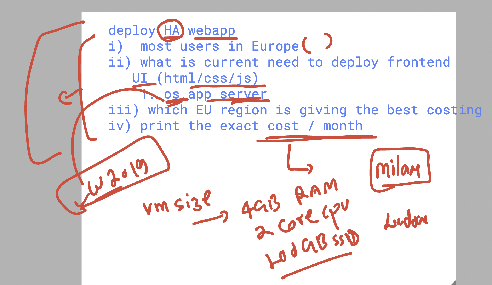
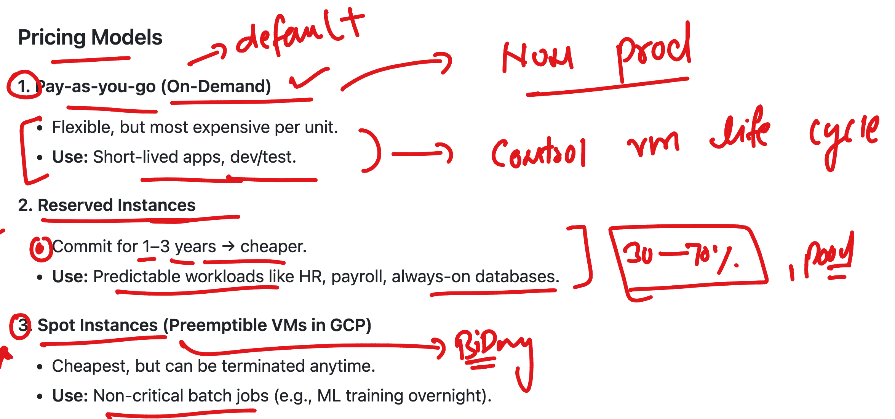

# walmart_TPM_CLOUD_USA_22ndsept2025

### a cloud platform gonna have 

### cloud system scale understading -- vertical scaling 

## cloud deployment models 

### private cloud option

### Region & av zone 

### in GCP -- access understanding 

### to Deliver any kind of resources cloud is having deliver Model 

## task1 

### pricing options in cloud VM 

