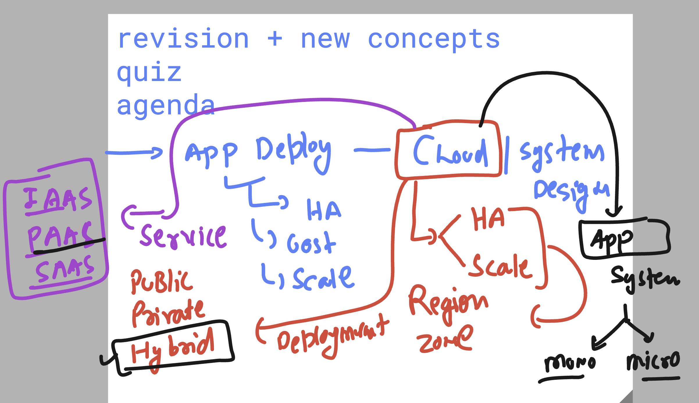
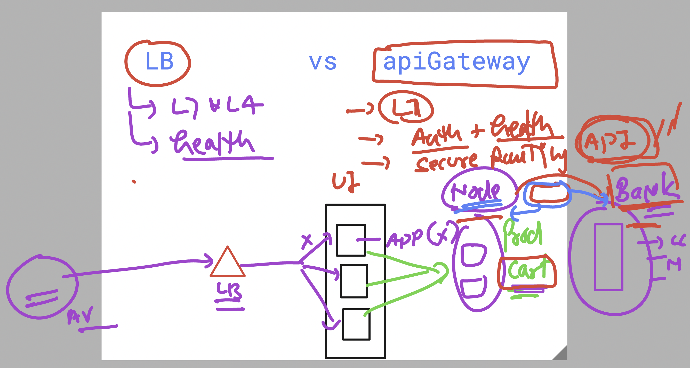
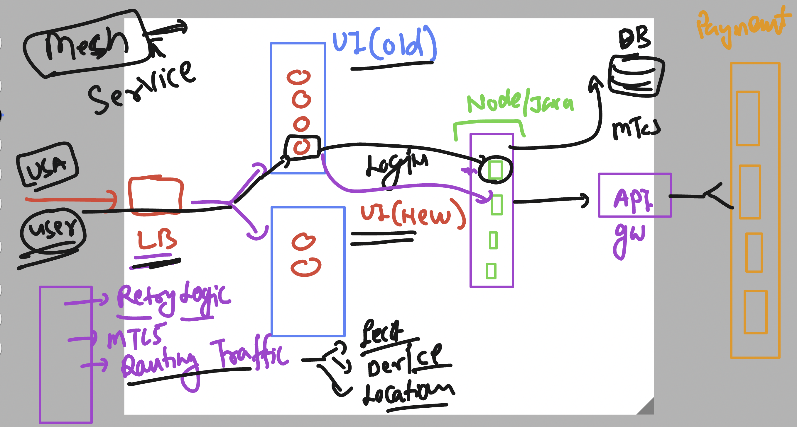
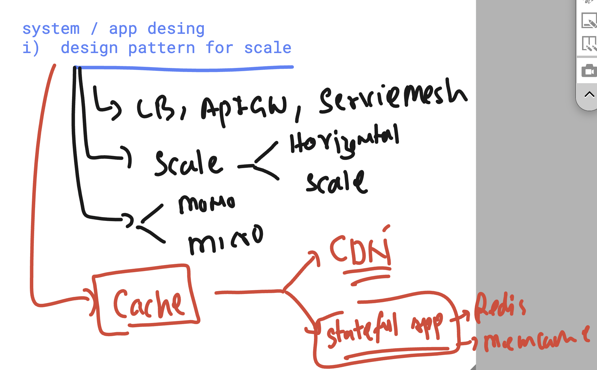
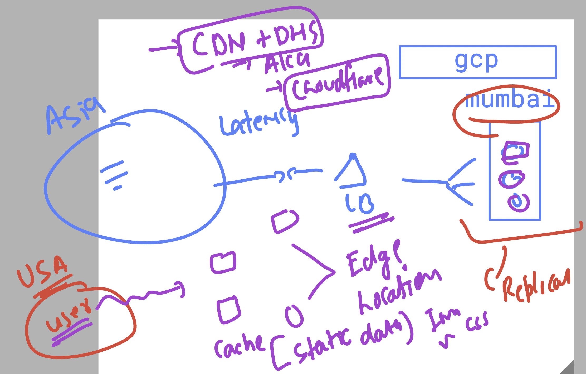
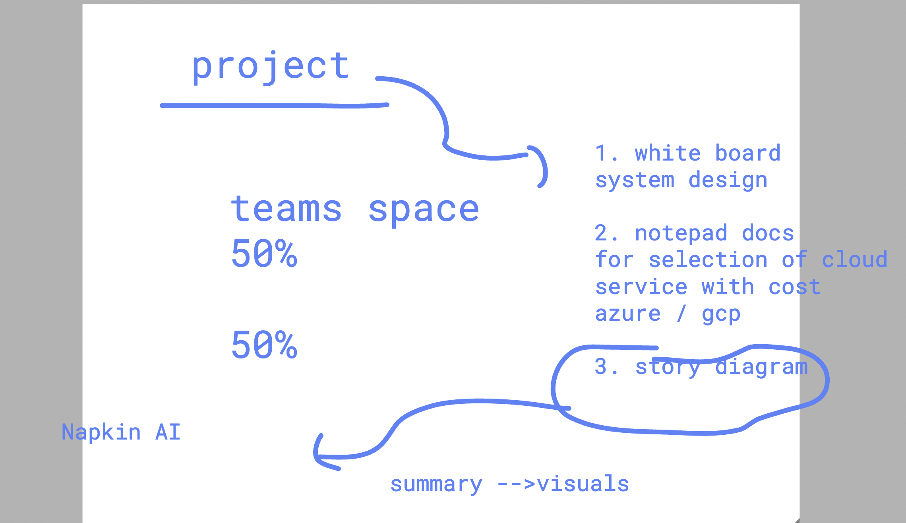
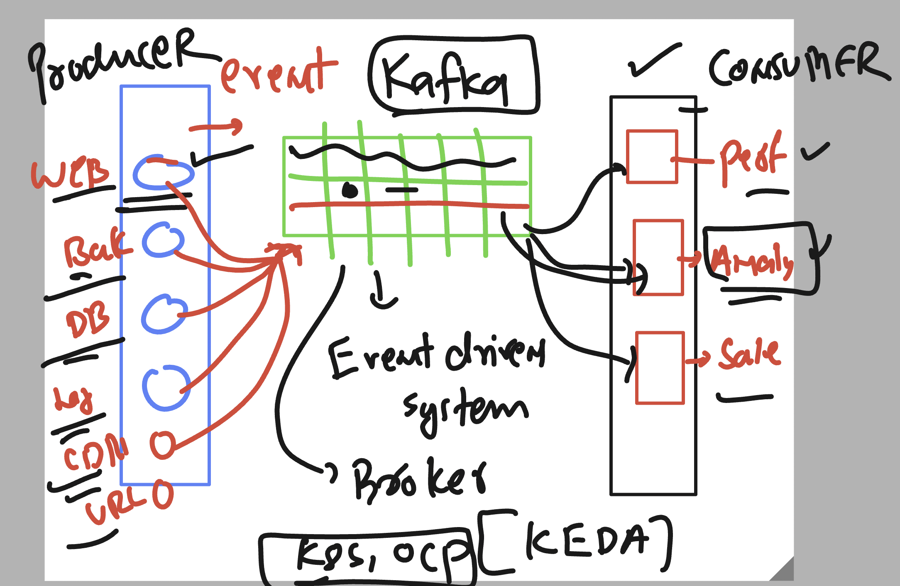
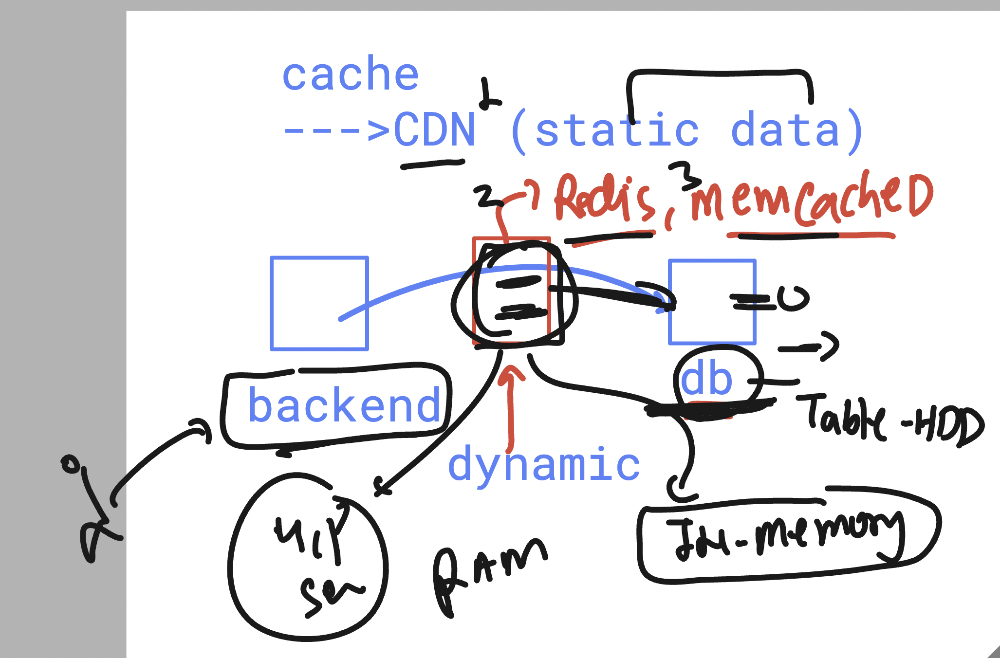

# walmart_TPM_CLOUD_USA_22ndsept2025

### quick revision 

### LB vs apigateway 

| Feature | Load Balancer | API Gateway |
|---------|---------------|-------------|
| Main Role | Distributes traffic | Manages and secures APIs |
| Focus | Availability & Scalability | Security, Routing, Governance |
| Knows About APIs? | ❌ No (only routes to servers) | ✅ Yes (understands API endpoints, versions) |
| Handles Auth? | ❌ No | ✅ Yes |
| Protocol Support | L4 (TCP/UDP), L7 (HTTP/HTTPS) | L7 only (HTTP/HTTPS, gRPC) |
| Use Case | Spread traffic among app servers | Control access, apply policies, version APIs |
| Azure Service | Azure Load Balancer / App Gateway | Azure API Management |
| GCP Service | Cloud Load Balancing | Apigee / API Gateway |

## in microservices addtional businesslogic implementation is a messy job 

### introducing service mesh 

### Service mesh more info 

[service_mesh](service_mesh.md)

## intro to Design pattern for scale 

### caching intro 

### CDN & edge location understanding 

### CAP theorem 

# CAP Theorem in Cloud (Azure & GCP Examples)

The CAP theorem says that in a distributed system, you can only strongly guarantee two out of three:

- Consistency
- Availability
- Partition Tolerance

Since cloud systems are distributed across regions/zones, Partition Tolerance (P) is a must → so you're usually choosing between C and A.

## Azure & GCP Mapping

| CAP Property | What It Means | Azure Example | GCP Example | When It's Used |
|--------------|---------------|---------------|-------------|----------------|
| Consistency (C) | All users see the same data immediately, no stale reads. | Azure Cosmos DB (Strong Consistency mode) | Cloud Spanner (Strong mode) | Financial apps, banking, inventory mgmt (no tolerance for stale data). |
| Availability (A) | System always responds, even if some data may be slightly outdated. | Azure Cosmos DB (Eventual Consistency mode) | Cloud Datastore / Firestore (Eventual Consistency) | Social media feeds, messaging apps, analytics dashboards. |
| Partition Tolerance (P) | System continues working despite network splits or region failures. | Built into Cosmos DB Global Distribution | Built into Spanner / Bigtable with multi-region setup | Always needed for cloud systems spanning zones/regions. |

===>
🔸 Real-World TPM-Level Explanation

If you pick Consistency + Partition Tolerance (CP) → During a failure, the system may reject requests to avoid stale data. (e.g., a payment transaction system).

If you pick Availability + Partition Tolerance (AP) → The system will always serve requests, but users might see slightly stale data. (e.g., user profile updates in a social network).

### project delivery 

### understanding event driven system using apache kafak 

## caching in db + backend based content 

